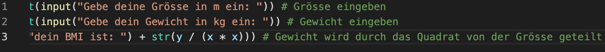

# BMI Programm 

## Benutzung des Programmes 
Das Programm berechnet den BMI des Menschens.

Man giebt seine Grösse und sein Gewicht an, damit das Programm den BMI berechnen kann.

Das Gewicht wird durch das Quadrat von der Grösse geteilt.  

